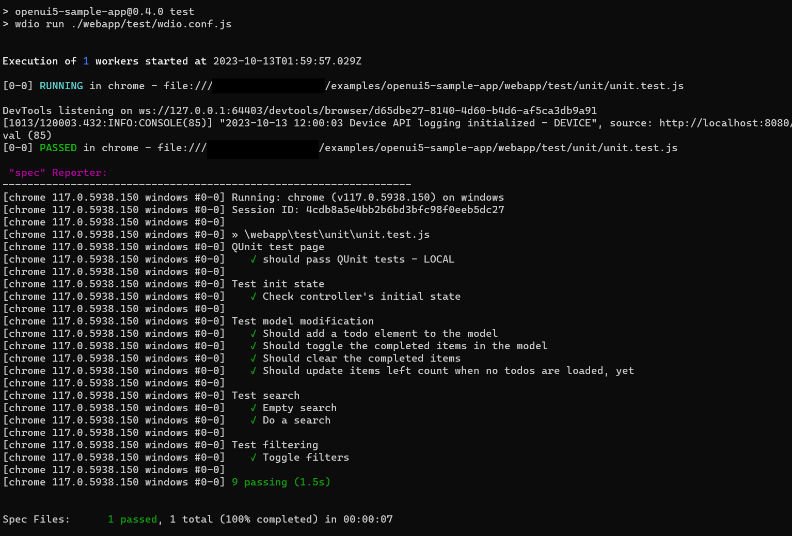

# wdio-qunit-service

[](https://www.npmjs.com/package/wdio-qunit-service) [](https://github.com/mauriciolauffer/wdio-qunit-service/actions/workflows/test.yml)

[WebdriverIO](https://webdriver.io/) (wdio) service for running [QUnit](https://qunitjs.com/) browser-based tests and dynamically converting them to `wdio` test suites.

## Replacing Karma

`QUnit Service` is a drop-in replacement for those using [Karma JS](https://karma-runner.github.io/latest/index.html) to run their `QUnit` tests ([karma-qunit](https://github.com/karma-runner/karma-qunit/), [karma-ui5](https://github.com/SAP/karma-ui5) or any other combination of Karma and QUnit). Karma is [deprecated](https://github.com/karma-runner/karma) and people should move to modern alternatives!

If you want to keep your QUnit tests as they are, with no rewriting and no refactoring, `QUnit Service` is everything you need. It runs your QUnit HTML files in a browser and captures all the results in `wdio` format.

Because of that, developers can use `QUnit Service` in tandem with everything else available in the `wdio` ecosystem.

Want to record the test run in a [video](https://webdriver.io/docs/wdio-video-reporter/)? Perhaps take a [screenshot](https://webdriver.io/docs/api/browser/saveScreenshot/) or save it in [PDF](https://webdriver.io/docs/api/browser/savePDF/)? Check the [Code coverage](https://webdriver.io/docs/devtools-service/#capture-code-coverage)? Save the test results in [JUnit](https://webdriver.io/docs/junit-reporter) format? Go for it, `QUnit Service` doesn't get on your way.

## Installation

After configuring `WebdriverIO`, install `wdio-qunit-service` as a devDependency in your `package.json` file.

```shell
npm install wdio-qunit-service --save-dev
```

If you haven't configured `WebdriverIO` yet, check the official [documentation](https://webdriver.io/docs/gettingstarted) out.

## Configuration

In order to use `QUnit Service` you just need to add it to the `services` list in your `wdio.conf.js` file. The wdio documentation has all information related to the [configuration file](https://webdriver.io/docs/configurationfile):

```js
export const config = {
    // ...
    services: ['qunit'],
    // ...
};
```

## Usage

In your WebdriverIO test, you need to navigate to the QUnit HTML test page, then call `browser.getQUnitResults()`.

```js
describe('QUnit test page', () => {
  it('should pass QUnit tests', async () => {
    await browser.url('http://localhost:8080/test/unit/unitTests.qunit.html');
    const qunitResults = await browser.getQUnitResults();
    expect(qunitResults).toBeTruthy();
  });
});
```

It's recommended to have one WebdriverIO test file per QUnit HTML test page. This ensures the tests will run in parallel and fully isolated.

Make sure the web server is up and running before executing the tests. `wdio` will not start the web server.

### Test results

Test results could look like:


## Examples

Check the [examples](./examples/) folder out for samples using `javascript`, `typescript` and more.

### Usage in SAP Fiori / UI5 apps

Straight forward [example](./examples/openui5-sample-app/) using the well known [openui5-sample-app](https://github.com/SAP/openui5-sample-app):

- Create a configuration file: [wdio.conf.js](.examples/openui5-sample-app/webapp/test/wdio.conf.js)

- Create a WebdriverIO test file for [unit tests](./examples/openui5-sample-app/webapp/test/unit/unit.test.js) and another for [OPA5 tests](./examples/openui5-sample-app/webapp/test/integration/integration.test.js).

- The web server must be running before executing the tests.

- Run it $ `wdio run ./webapp/test/wdio.conf.js`

## Author

Mauricio Lauffer

- LinkedIn: [https://www.linkedin.com/in/mauriciolauffer](https://www.linkedin.com/in/mauriciolauffer)

## License

This project is licensed under the MIT License - see the [LICENSE](LICENSE) file for details.
